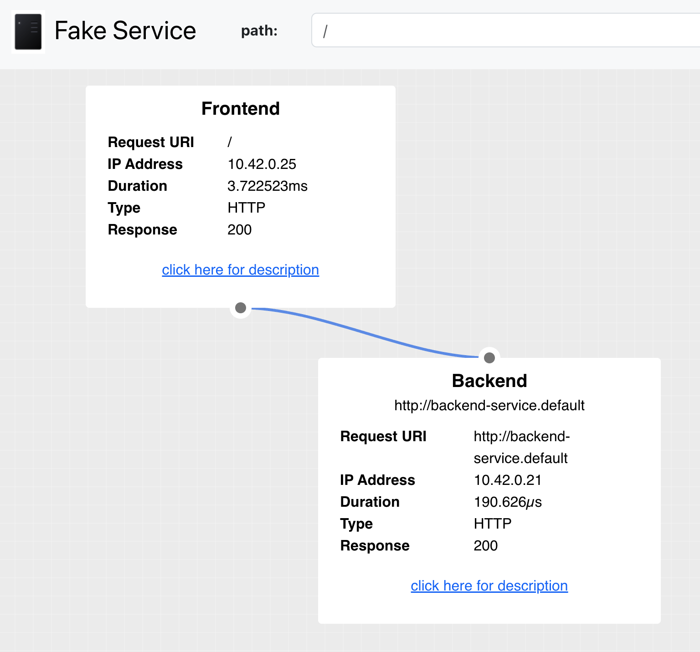
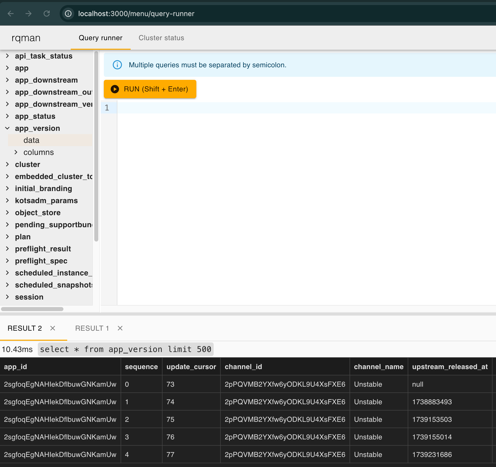
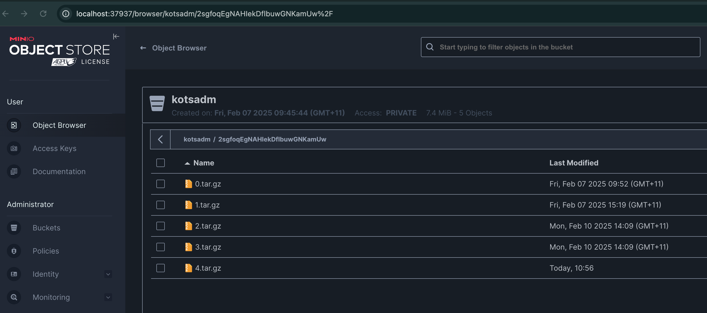

# helm-fake-service

This repository contains an example Helm chart that distributed with Replicated Embedded Cluster.



## Components

- A Helm chart using [fake-service](https://github.com/nicholasjackson/fake-service)
- Replicated [manifests](https://docs.replicated.com/reference/custom-resource-about) to deploy the chart with Replicated

## Replicated features

- [x] Packaged as a Helm chart
- [x] Installation works via Helm CLI, as well as KOTS & Embedded Cluster
- [x] Support Online and Airgap install
- [x] Replicated SDK installed
- [x] Custom Metrics implemented
- [x] Github Actions workflow for Replicated test and release
- [x] Support Replicated Proxy Service
- [x] Support Replicated Custom Domain

## Troubleshooting features for CRE

We do include utility pods to peek into KOTS Admin Console underlying database and object storage (Minio).

### rqlite

For database, to peek into `rqlite` database, you can use the following command:

```bash
kubectl port-forward svc/rqlite-ui-service 3000:80
```

And go to http://localhost:3000 to browse the database.



### Minio

For object storage, to peek into `minio` object storage, you can use the following command:

First, get the WebUI port from `kotsadm-minio-0` pod:

```log
kubectl logs kotsadm-minio-0
...
WebUI: http://10.42.0.11:<port>> http://127.0.0.1:<port>  
```

Next, port forward to the WebUI port:

```bash
kubectl port-forward svc/kotsadm-minio <port>:<port>
```

And go to http://localhost:<port> to browse the object storage.

The username is `admin` and the password is the secretkey in `kotsadm-minio` secret.

