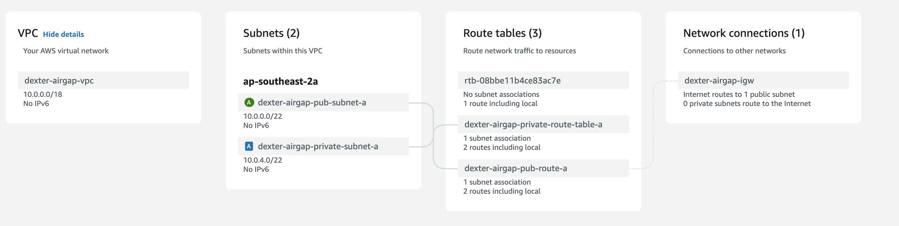

# Replibot

Replibot is a simple application that demonstrates how to use the Replicated Embedded Cluster to distribute a Kubernetes application in an Airgap environment. The application is implemented as a Helm chart and is distributed using the Replicated Embedded Cluster. It also includes a quickstart to create an airgap environment in AWS with terraform.

## Get Started

To get started with Replibot, you need to have an airgap environment. You can create an airgap environment in AWS using the terraform scripts provided in the `terraform` directory.

1. create a `terraform.tfvars` file in the `terraform` directory with the following content:

```hcl
aws_region        = "ap-southeast-2"
env               = "you-app-slug-test"
key_name = "you-app-slug-kurl"
vpc_cidr_block    = "10.0.0.0/18"
account_owner     = "yourcompany-dev"
instance_type     = "t3.xlarge"
public_cidr_block_map = {
  a = "10.0.0.0/22",
}

private_cidr_block_map = {
  a = "10.0.4.0/22",
}

airgap_download_script = "curl -f 'https://replicated.app/embedded/{you app slug}/unstable/15.4.17?airgap=true' -H 'Authorization: {your vendor api token}' -o {you app slug}-unstable.tgz"
```
replace the placeholders with your own values.

2. Setuo your AWS credentials in your .aws folder

3. Run the following commands to create the airgap environment:

```bash

cd terraform
terraform init
terraform apply
```

3. Once the environment is created. You will have a private and public subnet in the VPC. You can ssh into the public instance which has internet access and download the airgap bundle using the `airgap_download_script` provided in the `terraform.tfvars` file. It is a jumphost to the private instance which does not have internet access.

4. Once you have the airgap bundle, you can install the application using the Replicated Embedded Cluster. You can follow the instructions in the [Replicated documentation](https://docs.replicated.com/enterprise/installing-embedded-automation#air-gap-installation).


AWS infrastructure is created using the terraform scripts in the `terraform` directory. The scripts create a VPC with a public and private subnet. The public subnet has internet access and the private subnet does not have internet access. The public subnet is used as a jumphost to download the airgap bundle. The private subnet is used to install the application using the Replicated Embedded Cluster.

Diagram of the AWS infrastructure:



## Helm installs

The application is implemented as a Helm chart. You can install the application using the following commands:

```bash
cd charts/replibot
helm install replibot .
```

The source code for the application is in the `replibot/api` directory. The Helm chart is in the `charts/replibot` directory. The Helm chart installs a simple web application that displays a message and send custom metrics to vendor portal.


## Custom Metrics

To send a custom metric to the vendor portal, you can see the example in the `api/daemon/daemon.go` file. The `setCustomMetrics` function sends a custom metric to the vendor portal. You can modify the function to send your own custom metrics.

```go
func (d *Daemon) setCustomMetrics() error {
	// Send POST request to /metrics endpoint with json payload
	installID := os.Getenv("INSTALLED_INSTANCE_ID")

	resp, err := http.Post("http://replicated:3000/api/v1/app/custom-metrics", "application/json", strings.NewReader(`{"data":{"installed_instance_id":"`+installID+`"}}`))
	if err != nil {
		return err
	}
	defer resp.Body.Close()
	return nil
}

```

## Github Actions

The application uses Github Actions to build and push the Docker image to the Github Container Registry. The Github Actions workflow is defined in the `.github/workflows/build-release.yml` file. The workflow builds the Docker image and pushes it to the Github Container Registry. It also triggers the airgap bundle bundle build in the Replicated vendor portal.

```yaml
      - name: build airgap
        run: |
          curl --request POST \
            --url https://api.replicated.com/vendor/v3/app/${{ env.app_id }}/channel/${{ steps.get-release-channel-id.outputs.release-channel-id }}/release/${{ steps.get-channel-release-sequence.outputs.channel-release-sequence }}/airgap/build \
            --header 'Authorization: ${{ secrets.REPLICATED_API_TOKEN }}' \
            --header 'accept: application/json'
          
      - name: check airgap build success
        run: |
          max_retries=10
          attempt=0

          while true; do
            status=$(curl --silent --request GET \
              --url https://api.replicated.com/vendor/v3/app/${{ env.app_id }}/channel/${{ steps.get-release-channel-id.outputs.release-channel-id }}/releases \
              --header "Authorization: ${{ secrets.REPLICATED_API_TOKEN }}" \
              --header "accept: application/json" | jq -r '.releases[0].airgapBuildStatus')

            echo "Current airgapBuildStatus: $status"

            if [ "$status" == "built" ]; then
              echo "Airgap build is complete!"
              break
            elif [ "$status" == "failed" ]; then
              echo "Airgap build has failed. Exiting with error."
              exit 1
            elif [ "$status" == "building" ]; then
              echo "Airgap build is still in progress. Waiting for 60 seconds..."
              sleep 60
            fi

            attempt=$((attempt + 1))
            if [ "$attempt" -ge "$max_retries" ]; then
              echo "Maximum retries reached. Exiting with error."
              exit 1
            fi
          done
```

To use Github Actions, you need to set the following secrets and configs in the Github repository:
- `REPLICATED_API_TOKEN`: The Replicated vendor API token
- `DOCKERHUB_USERNAME`: The Dockerhub username
- `DOCKERHUB_TOKEN`: The Dockerhub token
- `app_id`: The Replicated application ID
- `channel_name`: The Replicated release channel name
