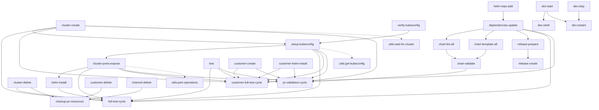

# WG-Easy Taskfile Dependency Graph

## Visual Dependency Flow



## Task Complexity Levels

### Simple Tasks (No Dependencies)
- `default`, `test`, `cluster-list`
- `customer-create`, `customer-ls`, `customer-delete`
- `channel-create`, `channel-delete`
- `clean`, `airgap-build`
- All `dev:*` base tasks
- All `utils:*` tasks

### Moderate Tasks (1-2 Dependencies)
- `dependencies-update` → `helm-repo-add`
- `chart-lint-all` → `dependencies-update`
- `chart-template-all` → `dependencies-update`
- `setup-kubeconfig` → `cluster-create`, `verify-kubeconfig`
- `cluster-ports-expose` → `cluster-create`

### Complex Tasks (3+ Dependencies)
- `helm-install` → `setup-kubeconfig`, `cluster-ports-expose`
- `chart-validate` → `chart-lint-all`, `chart-template-all`
- `release-create` → `release-prepare` → `dependencies-update`

### Workflow Orchestrators (High Complexity)
- **full-test-cycle**: 8 task calls
- **customer-full-test-cycle**: 7 task calls  
- **pr-validation-cycle**: 9 task calls
- **cleanup-pr-resources**: 3 cleanup task calls

## Critical Path Analysis

### For Development (Chart Testing)
```
helm-repo-add → dependencies-update → chart-lint-all/chart-template-all → chart-validate
```

### For Deployment Testing
```
cluster-create → setup-kubeconfig → cluster-ports-expose → helm-install → test
```

### For Release Management
```
helm-repo-add → dependencies-update → release-prepare → release-create
```

### For PR Validation (Complete Flow)
```
chart-validate → customer-create → cluster-create → setup-kubeconfig → 
cluster-ports-expose → customer-helm-install → test
```

## Dependency Characteristics

- **Linear Dependencies**: Most tasks follow clear sequential patterns
- **Parallel Opportunities**: Chart validation tasks can run in parallel
- **Resource Dependencies**: Infrastructure tasks must run in order
- **Cleanup Isolation**: Cleanup tasks are independent of build/deploy chains
- **Utility Abstraction**: Common operations abstracted to utils namespace

## Task Reference

### Infrastructure Tasks
| Task | Dependencies | Purpose |
|------|-------------|---------|
| `cluster-create` | None | Create test cluster using Replicated CMX |
| `setup-kubeconfig` | `cluster-create`, `verify-kubeconfig` | Configure kubectl access |
| `cluster-ports-expose` | `cluster-create` | Expose cluster ports for access |
| `cluster-delete` | None | Clean up test clusters |

### Chart Development Tasks
| Task | Dependencies | Purpose |
|------|-------------|---------|
| `helm-repo-add` | None | Add required Helm repositories |
| `dependencies-update` | `helm-repo-add` | Update all chart dependencies |
| `chart-lint-all` | `dependencies-update` | Lint all Helm charts |
| `chart-template-all` | `dependencies-update` | Template charts for validation |
| `chart-validate` | `chart-lint-all`, `chart-template-all` | Complete chart validation |
| `chart-package-all` | `dependencies-update` | Package charts for distribution |

### Deployment Tasks
| Task | Dependencies | Purpose |
|------|-------------|---------|
| `helm-install` | `setup-kubeconfig`, `cluster-ports-expose` | Deploy charts using helmfile |
| `customer-helm-install` | Same as `helm-install` | Deploy using customer license |
| `helm-uninstall` | `setup-kubeconfig` | Remove deployed charts |

### Release Tasks
| Task | Dependencies | Purpose |
|------|-------------|---------|
| `release-prepare` | `dependencies-update` | Prepare release artifacts |
| `release-create` | `release-prepare` | Create and promote Replicated release |

### Workflow Tasks
| Task | Dependencies | Purpose |
|------|-------------|---------|
| `full-test-cycle` | 8 tasks | Complete testing workflow |
| `customer-full-test-cycle` | 7 tasks | Customer-focused testing workflow |
| `pr-validation-cycle` | 9 tasks | PR validation workflow |
| `cleanup-pr-resources` | 3 cleanup tasks | Clean up PR test resources |

### Development Container Tasks
| Task | Dependencies | Purpose |
|------|-------------|---------|
| `dev:start` | None | Start development container |
| `dev:shell` | `dev:start` | Attach to container shell |
| `dev:restart` | `dev:stop`, `dev:start` | Restart development container |
| `dev:stop` | None | Stop development container |