# WG-Easy Taskfile Dependency Graph

## Visual Dependency Flow

```mermaid
graph TD
    %% Infrastructure Setup Chain
    CC[cluster-create<br/>📥 CLUSTER_NAME, K8S_VERSION<br/>📤 cluster ready] --> SK[setup-kubeconfig<br/>📥 CLUSTER_NAME<br/>📤 KUBECONFIG_FILE]
    SK --> CPE[cluster-ports-expose<br/>📥 CLUSTER_NAME, EXPOSE_PORTS<br/>📤 exposed URLs]
    CPE --> HI[helm-install<br/>📥 CLUSTER_NAME, HELM_ENV, CHANNEL<br/>📤 deployed charts]
    VK[verify-kubeconfig<br/>📥 CLUSTER_NAME<br/>📤 validated config] --> SK
    
    %% Chart Development Chain
    HRA[helm-repo-add<br/>📥 Chart.yaml files<br/>📤 repo index] --> DU[dependencies-update<br/>📥 Chart.yaml files<br/>📤 updated deps]
    DU --> CLA[chart-lint-all<br/>📥 chart directories<br/>📤 lint results]
    DU --> CTA[chart-template-all<br/>📥 chart directories<br/>📤 template validation]
    CLA --> CV[chart-validate<br/>📥 chart directories<br/>📤 validation status]
    CTA --> CV
    
    %% Release Chain
    DU --> RP[release-prepare<br/>📥 chart directories<br/>📤 release/ directory]
    RP --> RC[release-create<br/>📥 RELEASE_CHANNEL, RELEASE_VERSION<br/>📤 release sequence]
    
    %% Channel Management (NEW)
    CCH[channel-create<br/>📥 RELEASE_CHANNEL<br/>📤 CHANNEL_ID] --> CCR[customer-create<br/>📥 CUSTOMER_NAME, RELEASE_CHANNEL_ID<br/>📤 CUSTOMER_ID]
    CCH --> RC
    
    %% Test Workflows
    CC --> FTC[full-test-cycle<br/>📥 CLUSTER_NAME<br/>📤 test results]
    SK --> FTC
    CPE --> FTC
    DU --> FTC
    HI --> FTC
    T[test<br/>📥 running cluster<br/>📤 test status] --> FTC
    CD[cluster-delete<br/>📥 CLUSTER_NAME<br/>📤 cleanup status] --> FTC
    
    %% Customer Workflow (UPDATED)
    CC --> CFTC[customer-full-test-cycle<br/>📥 CUSTOMER_NAME, CLUSTER_NAME<br/>📤 deployment status]
    SK --> CFTC
    CPE --> CFTC
    CCR --> CFTC
    CHI[customer-helm-install<br/>📥 CUSTOMER_NAME, CLUSTER_NAME, CHANNEL_ID<br/>📤 deployment status] --> CFTC
    T --> CFTC
    
    %% PR Validation Workflow (UPDATED)
    CV --> PVC[pr-validation-cycle<br/>📥 BRANCH_NAME<br/>📤 validation status]
    CCH --> PVC
    CCR --> PVC
    CC --> PVC
    SK --> PVC
    CPE --> PVC
    CHI --> PVC
    T --> PVC
    
    %% Cleanup (UPDATED)
    CD --> CPR[cleanup-pr-resources<br/>📥 BRANCH_NAME<br/>📤 cleanup status]
    CUST_DEL[customer-delete<br/>📥 CUSTOMER_ID<br/>📤 archive status] --> CPR
    CH_DEL[channel-delete<br/>📥 RELEASE_CHANNEL_ID<br/>📤 archive status] --> CPR
    
    %% Utility Dependencies
    CC -.-> UWC[utils:wait-for-cluster<br/>📥 CLUSTER_NAME, TIMEOUT<br/>📤 ready status]
    SK -.-> UGK[utils:get-kubeconfig<br/>📥 CLUSTER_NAME<br/>📤 kubeconfig file]
    CPE -.-> UPO[utils:port-operations<br/>📥 CLUSTER_NAME, OPERATION<br/>📤 port status/URLs]
    CCR -.-> UGL[utils:get-customer-license<br/>📥 CUSTOMER_NAME<br/>📤 LICENSE_ID]
    
    %% Container Workflows
    DS[dev:start<br/>📥 DEV_CONTAINER_*<br/>📤 container ready] --> DSH[dev:shell<br/>📥 container name<br/>📤 shell session]
    DS --> DR[dev:restart<br/>📥 container config<br/>📤 restarted container]
    DST[dev:stop<br/>📥 container name<br/>📤 stopped container] --> DR

    %% Airgap Build (UPDATED)
    AB[airgap-build<br/>📥 RELEASE_CHANNEL/RELEASE_CHANNEL_ID<br/>📤 airgap bundle status]
```



## Task Variable Reference

### Infrastructure Tasks

#### `cluster-create`

- **Inputs**: `CLUSTER_NAME`, `K8S_VERSION`, `DISK_SIZE`, `INSTANCE_TYPE`, `DISTRIBUTION`, `EMBEDDED`, `TTL`, `REPLICATED_LICENSE_ID` (for embedded)
- **Outputs**: Cluster ready status, normalized cluster name
- **Dependencies**: None
- **Purpose**: Create test cluster using Replicated CMX

#### `setup-kubeconfig`

- **Inputs**: `CLUSTER_NAME`, `KUBECONFIG_FILE`, `DISTRIBUTION`
- **Outputs**: Kubeconfig file path
- **Dependencies**: `cluster-create`, `verify-kubeconfig`
- **Purpose**: Configure kubectl access and prepare cluster

#### `cluster-ports-expose`

- **Inputs**: `CLUSTER_NAME`, `EXPOSE_PORTS`
- **Outputs**: Exposed port URLs
- **Dependencies**: `cluster-create`
- **Purpose**: Expose cluster ports for external access

#### `cluster-delete`
- **Inputs**: `CLUSTER_NAME`
- **Outputs**: Cleanup status
- **Dependencies**: None
- **Purpose**: Clean up test clusters and kubeconfig files

### Chart Development Tasks

#### `helm-repo-add`
- **Inputs**: Chart.yaml files from charts/ directory
- **Outputs**: Updated Helm repository index
- **Dependencies**: None
- **Purpose**: Add required Helm repositories from Chart.yaml files

#### `dependencies-update`
- **Inputs**: Chart directories with Chart.yaml files
- **Outputs**: Updated chart dependencies in charts/*/charts/
- **Dependencies**: `helm-repo-add`
- **Purpose**: Update all chart dependencies

#### `chart-lint-all`
- **Inputs**: Chart directories
- **Outputs**: Lint validation results
- **Dependencies**: `dependencies-update`
- **Purpose**: Lint all Helm charts for syntax errors

#### `chart-template-all`
- **Inputs**: Chart directories
- **Outputs**: Template validation results
- **Dependencies**: `dependencies-update`
- **Purpose**: Template charts to validate syntax

#### `chart-validate`
- **Inputs**: Chart directories, helmfile template
- **Outputs**: Complete validation status
- **Dependencies**: `chart-lint-all`, `chart-template-all`
- **Purpose**: Complete chart validation including helmfile

#### `chart-package-all`
- **Inputs**: Chart directories
- **Outputs**: Packaged .tgz files in release/ directory
- **Dependencies**: `dependencies-update`, `release-prepare`
- **Purpose**: Package charts for distribution

### Channel Management Tasks (Enhanced)

#### `channel-create`
- **Inputs**: `RELEASE_CHANNEL`, `APP_SLUG`
- **Outputs**: `CHANNEL_ID` (unique identifier)
- **Dependencies**: None
- **Purpose**: Create release channel and return unique ID

#### `channel-delete`
- **Inputs**: `RELEASE_CHANNEL_ID`, `APP_SLUG`
- **Outputs**: Archive status
- **Dependencies**: None
- **Purpose**: Archive release channel by unique ID

### Customer Management Tasks (Updated)

#### `customer-create`
- **Inputs**: `CUSTOMER_NAME`, `CUSTOMER_EMAIL`, `RELEASE_CHANNEL`/`RELEASE_CHANNEL_ID`, `LICENSE_TYPE`, `EXPIRES_IN`, `APP_SLUG`
- **Outputs**: `CUSTOMER_ID`
- **Dependencies**: None
- **Purpose**: Create customer and return unique ID

#### `customer-delete`
- **Inputs**: `CUSTOMER_ID`, `APP_SLUG`
- **Outputs**: Archive status
- **Dependencies**: None
- **Purpose**: Archive customer by unique ID

### Deployment Tasks (Updated)

#### `helm-install`
- **Inputs**: `CLUSTER_NAME`, `HELM_ENV`, `REPLICATED_LICENSE_ID`, `CHANNEL` (ID or slug), `KUBECONFIG_FILE`
- **Outputs**: Deployment status
- **Dependencies**: `setup-kubeconfig`, `cluster-ports-expose`
- **Purpose**: Deploy charts using helmfile

#### `customer-helm-install`
- **Inputs**: `CUSTOMER_NAME`, `CLUSTER_NAME`, `REPLICATED_LICENSE_ID`, `CHANNEL_ID`/`CHANNEL_SLUG`, `KUBECONFIG_FILE`
- **Outputs**: Deployment status with customer registry authentication
- **Dependencies**: `setup-kubeconfig`, `cluster-ports-expose`
- **Purpose**: Deploy using customer license and registry authentication

### Release Tasks

#### `release-prepare`
- **Inputs**: Chart directories, replicated YAML files
- **Outputs**: release/ directory with prepared artifacts
- **Dependencies**: `dependencies-update`
- **Purpose**: Prepare release artifacts including packaged charts

#### `release-create`
- **Inputs**: `RELEASE_CHANNEL`, `RELEASE_VERSION`, `RELEASE_NOTES`, `APP_SLUG`
- **Outputs**: Release sequence number
- **Dependencies**: `release-prepare`
- **Purpose**: Create and promote Replicated release

### Workflow Orchestrators (Updated)

#### `full-test-cycle`
- **Inputs**: `CLUSTER_NAME` and all chart/deployment parameters
- **Outputs**: Complete test cycle status
- **Dependencies**: 8 tasks (create→setup→expose→update→preflight→install→test→delete)
- **Purpose**: Complete testing workflow with cleanup

#### `customer-full-test-cycle`
- **Inputs**: `CUSTOMER_NAME`, `CLUSTER_NAME`
- **Outputs**: Customer deployment status
- **Dependencies**: 7 tasks (create→setup→expose→customer-create→customer-install→test)
- **Purpose**: Customer-focused testing workflow (no cleanup for CD)

#### `pr-validation-cycle` (Enhanced)
- **Inputs**: `BRANCH_NAME`, `CHANNEL_NAME`
- **Outputs**: Complete PR validation status, `CHANNEL_ID`
- **Dependencies**: 9 tasks (validate→channel-create→release→customer-create→cluster-create→setup→expose→deploy→test)
- **Purpose**: Complete PR validation workflow with channel ID management

#### `cleanup-pr-resources` (Updated)
- **Inputs**: `BRANCH_NAME`, `CHANNEL_NAME`
- **Outputs**: Cleanup status
- **Dependencies**: 3 cleanup tasks (cluster-delete, customer-delete, channel-delete)
- **Purpose**: Clean up PR test resources using proper ID lookups

### Utility Tasks (Enhanced)

#### `utils:get-customer-license`
- **Inputs**: `CUSTOMER_NAME` (normalized)
- **Outputs**: `REPLICATED_LICENSE_ID`
- **Dependencies**: None
- **Purpose**: Retrieve customer license ID by normalized name

#### `utils:port-operations`
- **Inputs**: `CLUSTER_NAME`, `OPERATION` (expose/getenv), `EXPOSE_PORTS`
- **Outputs**: Port status or environment variables (TF_EXPOSED_URL)
- **Dependencies**: None
- **Purpose**: Manage cluster port exposure and URL retrieval

#### `utils:wait-for-cluster`
- **Inputs**: `CLUSTER_NAME`, `TIMEOUT`
- **Outputs**: Cluster ready status
- **Dependencies**: None
- **Purpose**: Wait for cluster to reach running state

### Airgap Tasks (Updated)

#### `airgap-build`
- **Inputs**: `RELEASE_CHANNEL`/`RELEASE_CHANNEL_ID`, `APP_SLUG`
- **Outputs**: Airgap bundle build status
- **Dependencies**: None
- **Purpose**: Build airgap bundle for releases, supports both channel names and IDs

## Task Complexity Levels

### Simple Tasks (No Dependencies)
- `default`, `test`, `cluster-list`
- `customer-create`, `customer-ls`, `customer-delete`
- `channel-create`, `channel-delete` (Enhanced with ID support)
- `clean`, `airgap-build`
- All `dev:*` base tasks
- All `utils:*` tasks

### Moderate Tasks (1-2 Dependencies)
- `dependencies-update` → `helm-repo-add`
- `chart-lint-all` → `dependencies-update`
- `chart-template-all` → `dependencies-update`
- `setup-kubeconfig` → `cluster-create`, `verify-kubeconfig`
- `cluster-ports-expose` → `cluster-create`

### Complex Tasks (3+ Dependencies)
- `helm-install` → `setup-kubeconfig`, `cluster-ports-expose`
- `chart-validate` → `chart-lint-all`, `chart-template-all`
- `release-create` → `release-prepare` → `dependencies-update`

### Workflow Orchestrators (High Complexity)
- **full-test-cycle**: 8 task calls
- **customer-full-test-cycle**: 7 task calls  
- **pr-validation-cycle**: 9 task calls (Enhanced with channel ID flow)
- **cleanup-pr-resources**: 3 cleanup task calls (Enhanced with ID lookups)

## Critical Path Analysis

### For Development (Chart Testing)

```text
helm-repo-add → dependencies-update → chart-lint-all/chart-template-all → chart-validate
```

### For Deployment Testing

```text
cluster-create → setup-kubeconfig → cluster-ports-expose → helm-install → test
```

### For Release Management (Enhanced)

```text
helm-repo-add → dependencies-update → release-prepare → channel-create → release-create
📤 CHANNEL_ID for downstream usage
```

### For PR Validation (Enhanced Flow)

```text
chart-validate → channel-create → release-create → customer-create → cluster-create → 
setup-kubeconfig → cluster-ports-expose → customer-helm-install → test
📤 CHANNEL_ID flows through customer-create and customer-helm-install
```

### For Customer Workflows (Enhanced)

```text
customer-create (with CHANNEL_ID) → cluster-create → setup-kubeconfig → 
cluster-ports-expose → customer-helm-install (with CHANNEL_ID) → test
```

## Channel ID Enhancement Benefits

### Unique Identification
- **Channel IDs**: Eliminate ambiguity with duplicate channel names across apps
- **Precise Targeting**: Tasks use unique identifiers for reliable channel operations
- **Error Reduction**: Reduced chance of operating on wrong channels

### Improved Data Flow
- **ID Propagation**: Channel IDs flow from creation through deployment
- **Backward Compatibility**: Tasks accept both channel names and IDs
- **Flexible Usage**: Supports both automated workflows and manual operations

### Enhanced Workflows
- **GitHub Actions**: Pass precise channel IDs between workflow jobs
- **Customer Management**: Create customers with specific channel IDs
- **Deployment Targeting**: Deploy to exact channels using IDs

## Variable Naming Conventions

### Input Variables
- `*_NAME`: Human-readable names (normalized for slugs)
- `*_ID`: Unique identifiers from Replicated API
- `*_SLUG`: URL-safe identifiers (legacy, prefer IDs)
- `NORMALIZED_*`: Transformed names for API compatibility

### Output Variables
- Functions return primary identifiers (IDs where available)
- Status outputs indicate success/failure
- File paths for generated artifacts

### Environment Variables
- `APP_SLUG`: Application identifier
- `REPLICATED_*`: API tokens and app references
- `KUBECONFIG`: Cluster access configuration

## Dependency Characteristics

- **Linear Dependencies**: Most tasks follow clear sequential patterns
- **Parallel Opportunities**: Chart validation tasks can run in parallel
- **Resource Dependencies**: Infrastructure tasks must run in order
- **Cleanup Isolation**: Cleanup tasks are independent of build/deploy chains
- **Utility Abstraction**: Common operations abstracted to utils namespace
- **ID Management**: Channel and customer IDs provide reliable resource targeting
